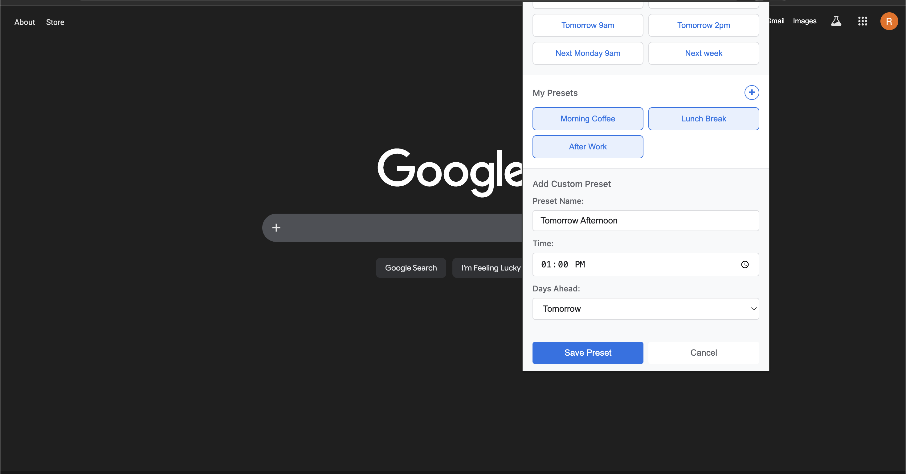

<div align="center">

# Tab Scheduler


**Snooze any browser tab and have it reopen exactly when you need it**

[](https://opensource.org/licenses/MIT)
[](https://chrome.google.com/webstore)
[](https://github.com/ErlichRonny/chrome-tab-scheduler/releases)
[](https://github.com/ErlichRonny/chrome-tab-scheduler/stargazers)

[Features](#features) • [Installation](#installation) • [Usage](#usage) • [Keyboard Shortcuts](#keyboard-shortcuts) • [Contributing](#contributing)

</div>

---

Found an article you want to read at lunch? A recipe to try this weekend? A GitHub PR to review Monday morning? Schedule the tab — it closes now and reopens right when you need it.

## Screenshots

<table>
<tr>
<td><br/><em>One-click scheduling with smart presets</em></td>
<td><br/><em>View, edit, search, and cancel scheduled tabs</em></td>
</tr>
<tr>
<td><br/><em>Themes, notifications, and more</em></td>
<td><br/><em>Create your own scheduling presets</em></td>
</tr>
<tr>
<td><br/><em>Full dark mode support</em></td>
</tr>
</table>

## Features

- ⚡ **Smart Presets**: One click to schedule for "Tomorrow 9am", "In 1 hour", "Next Monday", and more
- 🎨 **Custom Presets**: Create your own presets — "Morning Coffee", "After Work", anything you want
- 🗓️ **Custom Date/Time**: Pick any exact date and time with the calendar picker
- ↩️ **Undo**: Changed your mind? Hit undo within 5 seconds to cancel and reopen the tab
- 🖱️ **Context Menu**: Right-click any page and schedule it without opening the popup
- ⌨️ **Keyboard Shortcuts**: Schedule the current tab instantly without touching the mouse
- 📋 **Manage Schedule**: View, search, edit, and cancel all your scheduled tabs
- 📂 **Batch Opening**: Multiple tabs scheduled for the same time open together in one grouped window
- 🔔 **Notifications**: Desktop alerts when tabs are scheduled and when they reopen
- ⚙️ **Settings**: Light/dark/system theme, notification preferences, badge counter, and more
- 🔁 **Recurring Schedules**: Repeat a tab daily, on weekdays, weekly, or on custom days — forever or until an end date
- 💾 **Import/Export**: Back up and restore your scheduled tabs as JSON
- 🔄 **Reliable**: Works across browser restarts — missed schedules open automatically on next launch

## Installation

1. Clone or download this repository
2. Open Chrome and go to `chrome://extensions`
3. Enable **Developer mode** (toggle in the top-right corner)
4. Click **Load unpacked**
5. Select the extension directory (the folder containing `manifest.json`)
6. The Tab Scheduler icon appears in your toolbar

> Also works on Edge, Brave, and other Chromium-based browsers (Chrome 88+).

## Usage

### Quick Schedule

The fastest way to schedule a tab:

1. Open any webpage you want to save for later
2. Click the Tab Scheduler icon in your toolbar
3. Click a preset — **Tomorrow 9am**, **In 3 hours**, **Next Monday**, etc.
4. The tab closes immediately and reopens at the scheduled time

### Keyboard Shortcuts

Schedule without even opening the popup:

| Shortcut | Action |
|----------|--------|
| `Ctrl+Shift+.` (Mac: `⌘+Shift+.`) | Open Tab Scheduler popup |
| `Ctrl+Shift+S` (Mac: `⌘+Shift+S`) | Schedule current tab for tomorrow 9am |
| `Ctrl+Shift+L` (Mac: `⌘+Shift+L`) | Schedule current tab for 3 hours from now |

### Context Menu

Right-click anywhere on a page and choose **Schedule Tab** to access all presets without opening the popup.

### Custom Presets

Create presets that match your schedule:

1. Click **+** next to "My Presets"
2. Give it a name (e.g., "Lunch Break"), set a time and how many days ahead
3. Your preset appears as a one-click button alongside the built-in ones

Long-press any custom preset to edit or delete it.

### Custom Date/Time

For a specific moment:

1. Click the Tab Scheduler icon
2. Scroll to **Or Pick Custom Time**
3. Select your date and time with the calendar picker
4. Click **Schedule & Close Tab**

### Recurring Schedules

To have a tab reopen on a repeating schedule:

1. Scroll to **Or Pick Custom Time** and set your date and time
2. Toggle on **🔁 Repeat**
3. Choose a pattern:
   - **Daily** — reopens every day at the same time
   - **Weekdays** — reopens Monday through Friday
   - **Weekly** — reopens once a week on the same day
   - **Custom** — pick specific days of the week (e.g. Mon, Wed, Fri)
4. Optionally set an **End on** date — leave it as "Never" to repeat indefinitely
5. Click **Schedule & Close Tab**

Recurring tabs show a 🔁 badge next to their time in the scheduled list. Hover over the badge to see the full schedule (e.g. "Repeats weekdays (Mon–Fri) · no end date").

### Undo

Scheduled a tab by mistake? A confirmation toast appears for 5 seconds with an **Undo** button — click it to cancel the schedule and reopen the tab immediately.

### Managing Scheduled Tabs

Scroll down in the popup to see all your scheduled tabs. From here you can:

- **Search** — Filter tabs by title
- **Edit** — Change the scheduled time for any tab
- **Cancel** — Remove a tab from the schedule

### Batch Opening

When multiple tabs are scheduled for the same time, they all open together in a single window and are grouped under a "Snoozed" tab group — no clutter of multiple windows.

### Settings

Click the gear icon to customize:

- **Theme**: Light, Dark, or follow your system preference
- **Notifications**: Enable or disable desktop alerts
- **Badge counter**: Show the number of scheduled tabs on the extension icon
- **Default shortcut preset**: Choose what `Ctrl+Shift+S` schedules for
- **Import/Export**: Back up or restore your scheduled tabs as a JSON file

## Keyboard Shortcuts

| Shortcut | Action |
|----------|--------|
| `Ctrl+Shift+.` | Open Tab Scheduler |
| `Ctrl+Shift+S` | Schedule for tomorrow 9am |
| `Ctrl+Shift+L` | Schedule for 3 hours from now |

On Mac, use `⌘ Command` instead of `Ctrl`.

## Limitations

- Cannot schedule system tabs (`chrome://`, `about:`, etc.)
- Reopened tabs open in a new window, not their original position
- Requires Chrome to be running at the scheduled time — missed tabs open automatically on next browser launch

## Privacy

- All data is stored locally in your browser (`chrome.storage.local`)
- No external servers, no analytics, no data collection
- Open source — read the code yourself

See [PRIVACY.md](PRIVACY.md) for full details.

## Contributing

Contributions are welcome! See [CONTRIBUTING.md](CONTRIBUTING.md) for guidelines on setting up the project, code style, and submitting pull requests.

## For Developers

### File Structure

```
chrome-extension/
├── manifest.json           # Extension configuration
├── background.js           # Service worker (alarm handling, context menus)
├── settings.html           # Settings page UI
├── settings.js             # Settings page logic
├── settings.css            # Settings page styling
├── popup/
│   ├── popup.html         # Popup UI
│   ├── popup.css          # Popup styling
│   └── popup.js           # Popup logic
├── icons/
│   ├── icon16.png
│   ├── icon48.png
│   └── icon128.png
└── screenshots/
```

### Technical Details

- **Manifest V3** service worker architecture
- **chrome.alarms API** for reliable scheduling across browser restarts
- **chrome.storage.local** for persistent local data storage
- **chrome.tabGroups API** for batching simultaneously reopened tabs
- No external dependencies — pure JavaScript

### Data Structure

Scheduled tabs are stored under the key `scheduledTabs` in `chrome.storage.local`:

```json
{
  "alarm_1738453200000_abc123": {
    "alarmId": "alarm_1738453200000_abc123",
    "scheduledTime": 1738453200000,
    "tabInfo": {
      "url": "https://example.com",
      "title": "Example Page",
      "favIconUrl": "https://example.com/favicon.ico"
    },
    "createdAt": 1738366800000,
    "recurrence": {
      "pattern": "weekdays",
      "days": [],
      "time": "09:00",
      "endDate": null
    }
  }
}
```

The `recurrence` field is optional (absent for one-time tabs). `pattern` is one of `"daily"`, `"weekdays"`, `"weekly"`, or `"custom"`. For `"custom"` and `"weekly"`, `days` holds the day-of-week numbers (0 = Sunday). `endDate` is a Unix timestamp or `null` for no end.

### Debugging

**Service worker logs:**
1. Go to `chrome://extensions`
2. Find Tab Scheduler → click **service worker**
3. DevTools opens with the background script console

**Popup logs:**
1. Click the extension icon
2. Right-click the popup → **Inspect**

**Inspect storage or alarms in the service worker console:**
```javascript
chrome.storage.local.get('scheduledTabs', (data) => console.log(data))
chrome.alarms.getAll((alarms) => console.log(alarms))
```

### Permissions

| Permission | Purpose |
|------------|---------|
| `tabs` | Read tab URL, title, and favicon |
| `alarms` | Schedule reliable background timers |
| `storage` | Persist scheduled tab data locally |
| `notifications` | Show desktop alerts |
| `tabGroups` | Group multiple tabs reopening simultaneously |
| `contextMenus` | Add right-click scheduling menu |

## License

MIT — see [LICENSE](LICENSE) for details.
