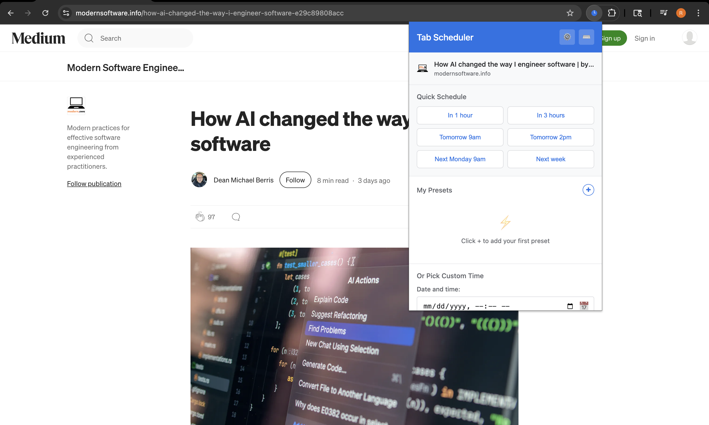
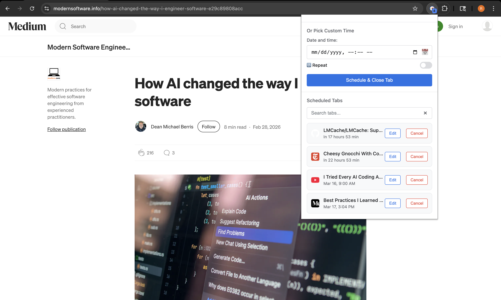
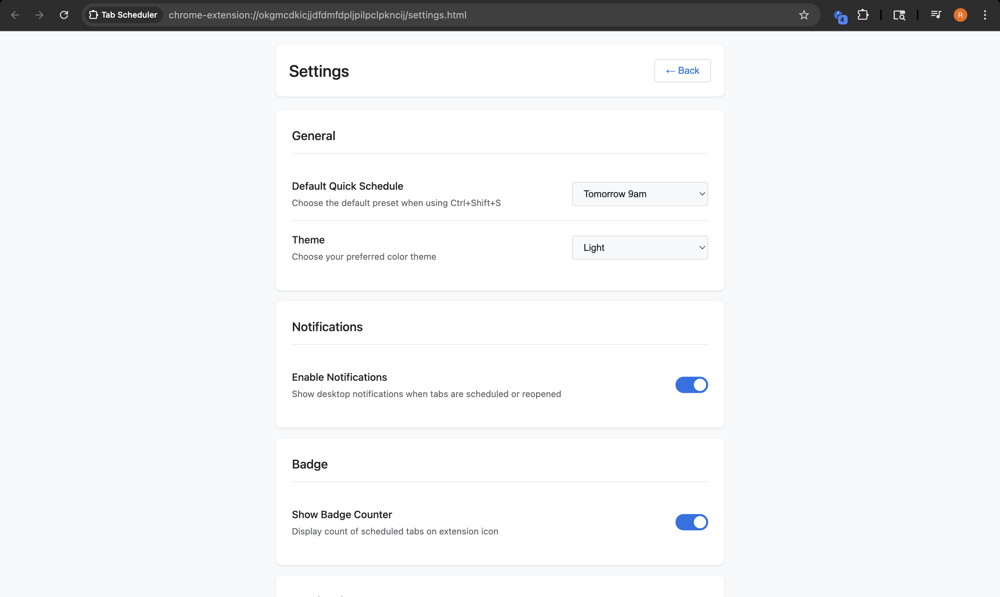
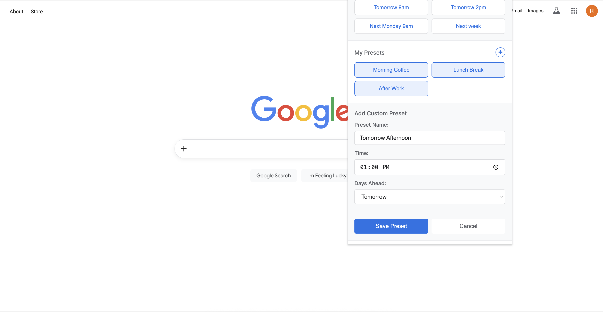

<div align="center">

# Tab Scheduler Chrome Extension


**Schedule browser tabs to reopen at any future time**

[](https://opensource.org/licenses/MIT)
[](https://chrome.google.com/webstore)
[](https://github.com/ErlichRonny/chrome-tab-scheduler/releases)
[](https://github.com/ErlichRonny/chrome-tab-scheduler/stargazers)

[Features](#features) • [Installation](#installation) • [Usage](#usage) • [Contributing](#contributing)

</div>

---

## Screenshots

<table>
<tr>
<td><br/><em>Quick schedule buttons</em></td>
<td><br/><em>Manage scheduled tabs</em></td>
</tr>
<tr>
<td><br/><em>Customization options</em></td>
<td><br/><em>Create your own presets</em></td>
</tr>
</table>

> **Note**: Screenshots will be added soon. See [screenshots/README.md](screenshots/README.md) for details.

## Features

- 📅 **Schedule Tabs**: Schedule any tab to reopen at a future date/time
- ⚡ **Smart Presets**: Quick buttons for "Tomorrow 9am", "In 1 hour", "Next Monday", etc.
- 🎨 **Custom Presets**: Create your own scheduling presets with custom times and labels
- 🗓️ **Calendar Picker**: Visual date/time picker for precise scheduling
- 📂 **Grouped Tabs**: Multiple tabs opening together (within 2 seconds) open in one window, grouped as "Snoozed"
- 🔔 **Desktop Notifications**: Get notified when tabs are scheduled and reopened
- 📋 **Manage Schedule**: View, search, edit, and cancel all scheduled tabs
- ⌨️ **Keyboard Shortcuts**: Quick actions with customizable keyboard shortcuts
- ⚙️ **Settings & Customization**: Themes, animations, notification preferences, and more
- 💾 **Import/Export**: Backup and restore your scheduled tabs
- 🔄 **Persistent & Reliable**: Works across browser restarts and handles missed schedules
- 🎯 **Clean, Modern UI**: Professional design with smooth animations and empty states

## Installation

### Load Unpacked (Development)

1. Clone or download this repository
2. Open Chrome and navigate to `chrome://extensions`
3. Enable "Developer mode" (toggle in top-right corner)
4. Click "Load unpacked"
5. Select the extension directory (the folder containing manifest.json)
6. The extension icon should appear in your toolbar

## Usage

### Quick Schedule (New!)

The fastest way to schedule a tab:

1. Navigate to any webpage you want to schedule
2. Click the Tab Scheduler icon in your toolbar
3. Click any Quick Schedule button:
   - **In 1 hour** / **In 3 hours** - For short-term scheduling
   - **Tomorrow 9am** / **Tomorrow 2pm** - For next-day scheduling
   - **Next Monday 9am** - For weekly planning
   - **Next week** - Same time, 7 days from now
4. The tab closes immediately and reopens at the scheduled time

### Custom Schedule

For specific dates and times:

1. Navigate to any webpage you want to schedule
2. Click the Tab Scheduler icon in your toolbar
3. Scroll to "Or Pick Custom Time"
4. Click the date/time picker (calendar icon 📅)
5. Select your desired date and time
6. Click "Schedule & Close Tab"
7. The tab closes immediately
8. At the scheduled time, the tab reopens as a new window

### View Scheduled Tabs

1. Click the Tab Scheduler icon
2. Scroll down to see all scheduled tabs
3. Each shows the page title and scheduled time

### Cancel a Scheduled Tab

1. Click the Tab Scheduler icon
2. Find the tab you want to cancel in the list
3. Click the "Cancel" button next to it

## How It Works

### Technical Details

- **Manifest V3**: Uses the latest Chrome extension standard
- **chrome.alarms API**: Reliable scheduling that persists across browser restarts
- **chrome.storage.local**: Stores scheduled tab data locally
- **chrome.windows API**: Creates new windows for reopened tabs
- **Service Worker**: Runs in background to handle alarms

### Data Structure

Scheduled tabs are stored in `chrome.storage.local` under the key `scheduledTabs`:

```json
{
  "alarm_1738453200000_abc123": {
    "alarmId": "alarm_1738453200000_abc123",
    "scheduledTime": 1738453200000,
    "tabInfo": {
      "url": "https://example.com",
      "title": "Example Page",
      "favIconUrl": "https://example.com/favicon.ico"
    },
    "createdAt": 1738366800000
  }
}
```

## Limitations

- Cannot schedule system tabs (`chrome://`, `about:`, etc.)
- Reopened tabs always open in a new window (not original position)
- Requires browser to be running at scheduled time (or next startup)

## Debugging

### View Service Worker Logs

1. Go to `chrome://extensions`
2. Find "Tab Scheduler"
3. Click "service worker" link
4. Opens DevTools with console logs

### View Popup Logs

1. Click extension icon to open popup
2. Right-click on popup → "Inspect"
3. Opens DevTools for popup

### Check Storage

In service worker DevTools console:
```javascript
chrome.storage.local.get('scheduledTabs', (data) => console.log(data))
```

### Check Alarms

In service worker DevTools console:
```javascript
chrome.alarms.getAll((alarms) => console.log(alarms))
```

## File Structure

```
chrome-extension/
├── manifest.json           # Extension configuration
├── background.js           # Service worker (alarm handling)
├── settings.html           # Settings page UI
├── settings.js             # Settings page logic
├── settings.css            # Settings page styling
├── popup/
│   ├── popup.html         # Popup UI
│   ├── popup.css          # Popup styling
│   └── popup.js           # Popup logic
├── icons/
│   ├── icon16.png         # 16x16 toolbar icon
│   ├── icon48.png         # 48x48 notifications
│   └── icon128.png        # 128x128 store listing
├── screenshots/           # Extension screenshots
└── README.md              # This file
```

## Permissions

The extension requires these permissions:

- **tabs**: Access to tab information (URL, title, favicon)
- **alarms**: Schedule tab reopening
- **storage**: Persist scheduled tab data
- **notifications**: Show desktop notifications
- **tabGroups**: Group multiple tabs reopening simultaneously
- **contextMenus**: Right-click context menu for scheduling

## Privacy

- All data stored locally in your browser
- No external servers or analytics
- No data collection or tracking
- Open source - audit the code yourself

## Compatibility

- Chrome 88+ (Manifest V3 support)
- Also works on Edge, Brave, and other Chromium-based browsers

## Future Enhancements

Potential features for future versions:

- Recurring schedules (daily/weekly)
- Natural language scheduling ("tomorrow at 9am")
- Bulk scheduling of multiple tabs
- Restore tabs in original position
- Statistics dashboard
- Browser sync support

## License

MIT License - feel free to modify and distribute

## Support

For issues or questions, please check the service worker logs and popup console for error messages.

## Version History

### 1.0.0 (Initial Release)
- Schedule tabs with date/time picker
- View scheduled tabs list
- Cancel scheduled tabs
- Desktop notifications
- Persists across browser restarts
- Handles missed schedules
